**Clarification Regarding the CS412 Folder in My Repository**

I initially created the app using Django, a framework I learned in CS412. However, I encountered difficulties setting up the Django project structure entirely from scratch. For this final project, I leveraged the configuration and initialization code from my CS412 class to establish the basic Django skeleton. Beyond that, I created the FinalProject app, Makefile, and requirements.txt specifically for this class.

# Starting the Server
There are two ways to start the server for testing the application:
## Option 1: Step-by-Step Commands
  1. Activate the Virtual Environment:
    - Run the following command to set up and activate the virtual environment:
    - make venv
  2. Install Dependencies:
    - After activating the virtual environment, run the following command to install the necessary dependencies:
    - make install
  3. Run the Application:
    - Once the dependencies are installed, start the application with:
    - make run
## Option 2: Automated Setup
  - Alternatively, you can use a single command that sets up the environment, installs the dependencies, and runs the application:
    - make setup

# Sign-in Information
Before testing the app, you need to sign in with the following credentials:
Username: thomas
Password: Th0mas123
# Reproducing the Results
To reproduce the results of the imputation experiments, follow these steps:
  1. Upload the Image:
    - Click on Upload Image and select an image to upload.
    - Choose a corruption level of 70 from the provided slider.
    - Click Upload.
  2. View the Images:
    - After uploading, you will see the original image, corrupted image, and the mask that was applied to the original image.
  3. Select the Imputation Method:
    - Select an imputation method from the available options:
      - Mean
      - Median
      - Mode
      - PCA
      - Total Variation in Painting
      - Imputation Method with PCA Preprocessing
## Note: When selecting the Imputation Method with PCA Preprocessing, only choose Mean, Median, or Mode. The PCA preprocessing is designed specifically for these methods and will cause an error if applied with other imputation methods.
  4. Generate the Imputation:
    - Click on Generate to apply the imputation method.
    - Note that PCA, Total Variation in Painting, and PCA Preprocessing methods may take a bit of time to complete (up to 5 minutes). During this time, the server will appear to be loading.
    - You can monitor the progress of the imputation method in the terminal where basic output logs are provided, showing the progression of the process.
  5. Re-apply Imputation to Another Image:
    - After generating an imputation, you can apply a different imputation method to the same or a new image by:
      - Clicking on Impute Another Image.
      - Select an already inputted image, which is tied to the mask and corrupted image.
      - Choose a new imputation method from the available options.
      - View Trends and Visualizations:
      - For PCA imputation or mean/median/mode preprocessing with PCA imputation, you will be able to see visualizations of the trends for PSNR (Peak Signal-to-Noise Ratio) and SSIM (Structural Similarity Index) scores with rank.
      - These visualizations help assess the performance of different ranks in the PCA-based imputation process.
  6. Visualizing the Results
    - To compare the imputation results visually, follow these steps:
      - 1) Generated Images:
      - Go to the Home Page (top left) and scroll down to Generated Images.
      - Here, you will see the images generated after applying the imputation technique, along with their corresponding PSNR and SSIM scores.
      - 2) Compare Imputation Methods:
      - You can also visualize PSNR, SSIM, and semi-log PSNR graphs by clicking on "Compare Imputation Methods" (top right).
      - This will display a comparison of the different imputation methods and their corresponding metrics.
## Note: Images used can be found in the /images directory.

# Model Evaluation
We use two metrics primarily to evaluate the quality of the reconstructed image. Visually, we can make qualitative judgments by seeing if there are any obvious visual artifacts in the resulting reconstruction, i.e. are there still any obvious areas of image corruption after the reconstruction process. 

A more quantitative approach involves using the peak-signal-to-noise ratio (PSNR) as well as the structural similarity index measure (SSIM). PSNR measures the fidelity of the restored image, with higher values indicating closer resemblance to the original. SSIM evaluates structural similarity, with values close to 1 indicating high similarity.

# Elementary Imputation Techniques with summary statistics

In the context of matrix completion, the mean, median, and mode imputation methods are basic statistical techniques used to fill in missing or corrupted pixel values based on the available (non-corrupted) pixels. These methods are typically applied to handle missing data in the image matrix, where a corrupted pixel (e.g., black or white pixels) needs to be replaced by a reasonable estimate based on neighboring pixels.

The missing value is replaced by the mean / mean / mode of the neighboring pixels or the non-corrupted pixels in the column. The mean represents the average pixel intensity in the column of the corrupted pixel.

We do not expect these methods to produce quality images, but we use them as a visual baseline to compare more sophisticated methods against. Moreover, using summary statistics as a way of matrix completion is common in numerical datasets since it is fast and easy to implement. 

# Principal Component Analysis Imputation

Principal Component Analysis (PCA) is a powerful statistical technique that reduces the dimensionality of data by transforming it into a set of linearly uncorrelated variables, known as principal components. These principal components are computed via the singular value decomposition (SVD) of the image matrix, and a low-rank representation of the image is learned via truncation of the singular vectors corresponding to lower singular values. 

In this project, we adopt an alternating minimization approach for the purpose of image / matrix completion. In this setting, the matrix is initialized by filling in arbitrary values for the unknown pixels. Subsequently, PCA / SVD is performed to extract the top k components as a low-rank reconstruction. This comes from the assumption that structured image data tends to be low rank in nature, and that the PCA procedure removes the noise present in the corruption. Afterwards, because the principal component truncation also modifies the original known pixels as well, they are filled in with the original values. 

This process iterates until the change in Frobenius norm of the pixel images between two iterations is below a given threshold or until a specified number of maximum interactions. This procedure is repeated for all three color channels of an RGB image, and the results are superimposed to create the final completed color image. 

# PCA Preprocessing with Mean, Median, or Mode Imputation

Before applying PCA-based imputation, it is often useful to apply a basic imputation technique like mean, median, or mode imputation to handle the initial corruption. The rationale behind this is that PCA is more effective when the missing values are filled with reasonable estimates, which can help avoid the introduction of noise from grossly corrupted pixels. This is essentially a combination of the naive techniques introduced earlier with PCA to create a better starting iterate for the PCA algorithm. 

# Convex Optimization: Total Variation Inpainting

Convex optimization is a celebrated field of tractable optimization problems with fast algorithms and strong theoretical foundations. Many problems in statistics, machine learning, signal processing, can be reduced to minimizing a convex function over a convex constraint set, where the resulting optimization problem can then be efficiently solved by interior point methods. Primarily, convex optimization-based approaches are nice because 1) any local optimum is a global optimum and 2) strong duality holds under relatively weak conditions, providing a certificate of optimality for our solution.

Total variation inpainting is one such technique that has seen incredible promise in image and signal reconstruction. Mathematically, the total variation measures the sum of the norms of discretized gradients across the image. Intuitively, the total variation measures smoothness across an image, and we use the idea that corrupted image pixels should roughly follow this smoothness pattern as well. However, one surprising property of the total variation function is that minimization still preserves sharp corners in the image instead of blurring or smoothening them out.

The most attractive feature of the total variation norm is that it is convex in its matrix argument. Namely, our optimization problem can be cast as follows: we find the matrix (representing one channel of our image) with minimal total variation subject to an affine equality constraint, i.e. the known pixels of our corrupted image occupy the corresponding entry of X. This allows us to specify the problem naturally in convex optimization libraries. 

The TV inpainting is implemented using the CVXPY optimization library. CVXPY allows the user to specify the optimization in a natural way following the grammar of Disciplined Convex Programming (DCP) rules. These are composition rules that ensure that the resulting problem is indeed convex and thus compatible with the backend solvers that perform the actual interior point methods for convex problems in some standard conic form. 

The following steps are followed:

The CVXPY Variables are defined as three matrices, each representing a color channel of our output image.
The constraints ensure that the corrupted pixels remain as they are, while the missing pixels are in-painted to minimize the total variation. This is done using an element-wise multiplication of the corrupted pixel bitmask against the problem variables and setting them equal to the corrupted image. 
Optimization: The optimization problem is solved using the SCS solver to convert the problem to a standard conic form and then solved with an interior point method. 

# Other attempts: Robust PCA: Decomposition as low-rank plus sparse

Another technique that has received recent attention is robust PCA, decomposing a matrix as a sum of a low rank component and a sparse component. Mathematically, for a data matrix M, we seek matrices L and S such that M = L + S, L is low rank, and S is sparse. We hypothesized that the low rank component L will correspond to the uncorrupted image, while the sparse component S will correspond to locations of image corruption. This can be found as the solution to the following optimization problem:

minimize rank(L) + λ * nnz(S)
subject to L + S = M

Here, ‘nnz’ refers to the number of nonzero elements of S and λ is a trade-off parameter between the two competing objectives. 

This technique has been historically successful in separation problems such as separating an unmoving background from a moving person in video surveillance footage. In some ways, it functions as a richer generalization of the matrix completion problem. While low-rank and sparsity constraints are nonconvex, convex relaxations of the rank constraint as the nuclear norm and the l-1 norm prove to be effective and even exact under some technical conditions. 

We implemented this method using CVXPY and unfortunately received results far inferior to any other method mentioned before, both visually and computationally. This is likely due to a number of issues.

The noise component is not sparse: the corruption occurs in approximately 70% of the pixels onscreen, which means that the corruption occupies actually a very dense subset of the matrix entries. Thus, the underlying assumption that the model is low-rank plus sparse is violated. 
The problem is extremely high-dimensional: CVXPY solves problems using interior-point methods which require the construction of a Hessian matrix. This means that the resulting solution process is not only slow, but incredibly memory-hungry. We also implemented custom first-order and proximal algorithms for solving this problem using singular-value thresholding, but the results were equally poor in terms of reconstruction quality. 
# Imputation Methods Performance Analysis: PSNR and SSIM Evaluation

## Comparing Mean, Median, and Mode (base models)

For realistic images, we noticed that for mean and median imputation they produced visually similar images:

**Turtle Mean Imputed Image**

**Turtle Median Imputed Image**

This just tells us that for a specific column, the mean and median pixel value must be very close. This was further confirmed via the PSNR and SSIM scores (see below in the graphs). However, the mode displays these visual artifacts of "streaks". 

**Turtle Mode Imputed Image**

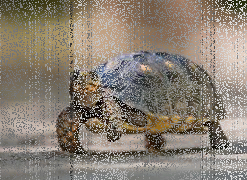

The poorer visual quality of the mode-imputed image is reflected in the lower SSIM scores. This outcome makes sense for realistic images, which typically have smooth gradients between pixels due to shading. In such cases, averaging (mean) or selecting the middle value (median) works best. On the other hand, mode imputation—filling in corrupted pixels with the most frequently occurring value—fails to capture these subtle gradients.

For some animated images, however, we noticed mean did relitively worse than median and mode 

**Pikachu Mean Imputed Image**

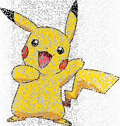

**Pikachu Median Imputed Image**

**Pikachu Mode Imputed Image**

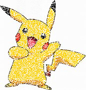

In this case, the streak artifacts are more prominent with mean imputation. Median and mode imputation produce cleaner results, which is also confirmed by the PSNR and SSIM scores (see graphs below). This difference is due to the nature of animated images, which often feature sharp contrasts between colors (e.g., Pikachu's yellow body against a white background) and a simpler color palette. Mean imputation tends to blur these contrasting colors, resulting in poor visual quality. In such cases, median or mode imputation preserves the sharp boundaries better than mean.

## Comparison with Base Models and PCA

**Turtle SSIM and Semi-log PSNR values**
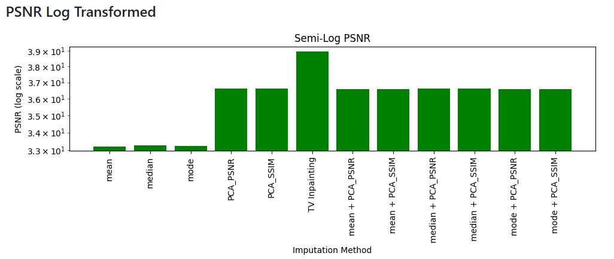
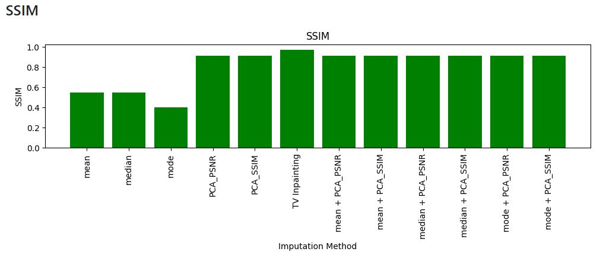

**Spiritomb SSIM and Semi-log PSNR values**
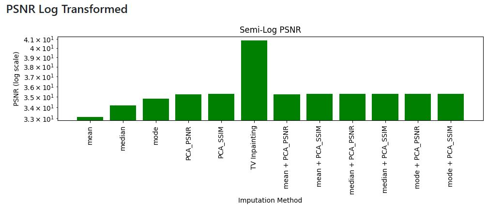
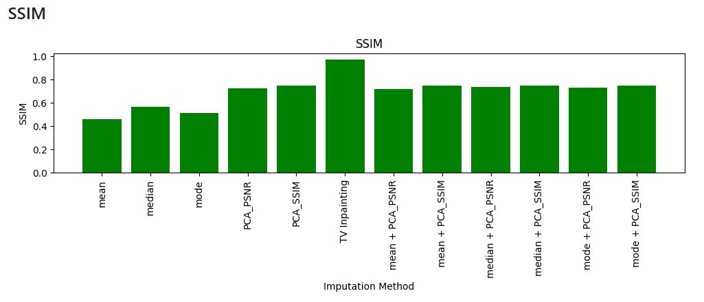
For most images, mean, median, and mode imputation methods produced significantly lower results, as observed in the semi-log evaluation of PSNR and the SSIM graph. This is expected, as these methods generally fill in missing pixels by using simple statistical measures (mean, median, or mode) without considering the underlying structure or global features of the image. While these methods can recover some of the missing data, they tend to lose finer details and textures, which results in poorer SSIM scores. PSNR, on the other hand, might still show reasonable values for these methods if the overall error in pixel values is small, especially for images with large homogeneous areas.
In contrast, we would expect PCA, TV inpainting, and PCA with summary statistic preprocessing to perform better because they capture the low dimensionality of the data while taking into account more global features of the image.  

**Pikachu SSIM and Semi-log PSNR values**
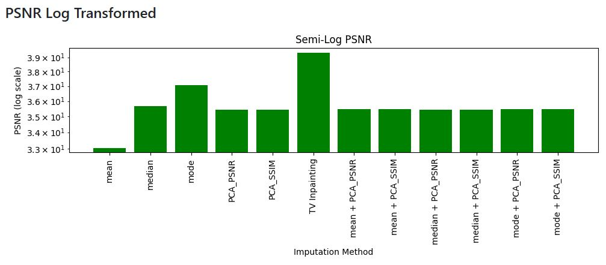
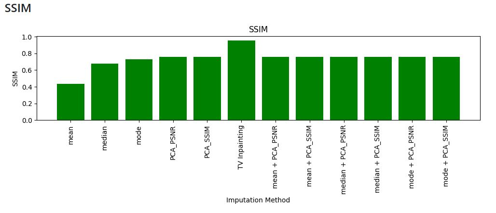
However, for this specific image (Pikachu), median and mode imputation methods ranked as the third and second-best performing in terms of PSNR, respectively. This is somewhat unexpected given the usual lower performance of these methods. The large homogeneous areas in the image (e.g., Pikachu’s yellow body) make median and mode imputation more effective (as explained above), as these methods can replace missing pixels with values that closely match the surrounding region. This reduces the overall pixel-wise error, which is why they perform relatively well in PSNR evaluation.
Despite their reasonable PSNR performance, median and mode imputation methods ranked among the lowest when it came to SSIM. This can be attributed to the fact that these methods do not take into account the structural and local patterns in the image, such as edges, textures, and fine details. SSIM measures the structural similarity between images, and since median and mode imputation methods fail to preserve these local features, they result in poor SSIM scores. In contrast, methods like PCA and TV inpainting are able to maintain the image’s structure and texture, leading to better SSIM performance.

## Further analysis on PCA Imputation with summary statistic preprocessing
An interesting finding was that PCA produced comparable results with PCA and mean/median/mode initialization. This can be further confirmed via visual comparisons. 

**Turtle PCA Imputed Image**

**Turtle PCA Imputed Image with Mean Preprocessing**

**Turtle PCA Imputed Image with Mean Preprocessing**

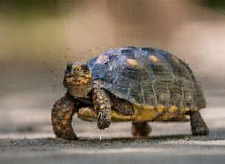

**Turtle PCA Imputed Image with Mode Preprocessing**

This is likely because PCA is already effective at capturing the underlying structure of the image and can extract the most important features from the data. Since PCA is designed to reduce dimensionality and focus on the key components of the image, the preprocessing steps (mean, median, or mode imputation) don't significantly enhance its performance. While these preprocessing methods provide a basic estimate of the missing data, they don't improve the ability of PCA to identify and refine the core features of the image. Therefore, PCA alone can still achieve strong results, making the additional preprocessing unnecessary for improving performance.

**Pikachu SSIM and PSNR graphs**

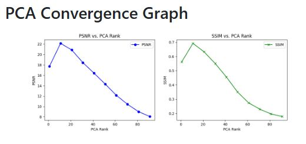

**Cat SSIM and PSNR graphs**

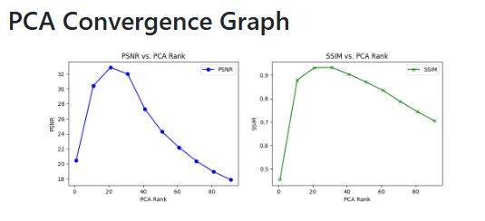

**Turtle SSIM and PSNR graphs**

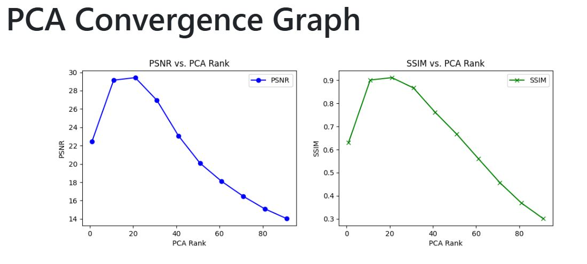

**Spiritomb SSIM and PSNR graphs**

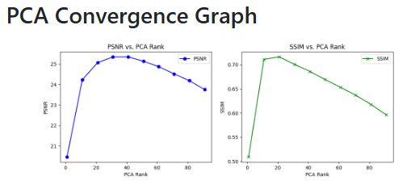

When analyzing the peak of the PSNR and SSIM scores, the optimal rank for reconstruction for all of them was when we took the 20 first components. This could be because the PSNR and SSIM scores, despite being distinct metrics, are often correlated when it comes to image quality. Both metrics aim to measure how well the reconstructed image matches the original image, albeit from different perspectives (PSNR from a pixel-wise error perspective and SSIM from a structural similarity perspective). Thus, the rank that achieves the best performance in one metric is likely to perform well in the other, leading to similar optimal ranks for both PSNR and SSIM in most cases.
What I found after conducting multiple experiments on realistic and cartoon images was that there was no exact pattern when it came to the trends of rank with PSNR and SSIM, only that there is a peak and then it decreases. This behavior can be attributed to the nature of low-rank approximations used in PCA. Initially, increasing the rank captures more features of the image, improving the imputation. However, beyond a certain rank, the model begins to capture noise and less relevant features, leading to overfitting. This results in a decline in performance as the rank increases further, which is reflected in both PSNR and SSIM scores.
The differences in the graphs can be attributed to the image content and complexity. For realistic images, where there are more subtle textures and fine details, higher ranks may be needed to capture the necessary features, while animated images, which are often simpler and more uniform in structure, may not require as high a rank to achieve good results. Additionally, the nature of the image—whether it contains high-frequency details or smooth gradients—affects how the rank influences performance. The choice of rank must balance between capturing enough information to improve quality and avoiding overfitting by capturing irrelevant details.

# Visual Comparison Between All Image Imputation Methods

For the sake of brevity, this report will present only the generated images for the Turtle image using the following methods: Mean, Median, Mode, PCA (with the best SSIM), Total Variation Inpainting, and PCA with Mean Preprocessing (best SSIM).

**Turtle Original Image**

**Turtle Mean Imputed Image**

**Turtle Median Imputed Image**

**Turtle Mode Imputed Image**

**Turtle PCA Imputed Image**

**Turtle Total Variation in Painting Imputed Image**

**Turtle PCA Imputed Image with Mean Preprocessing**

Visually, PCA and PCA with Mean Preprocessing outperformed Mean, Median, and Mode imputation. Total Variation Inpainting delivered the best results, with no noticeable visual artifacts.

# Final Conclusions:
After conducting extensive experiments with various imputation methods, it is clear that Total Variation Inpainting consistently outperformed other techniques across different types of images both visually and by performance metrics. This method demonstrated superior performance in terms of both PSNR (Peak Signal-to-Noise Ratio) and SSIM (Structural Similarity Index) scores, making it the most reliable for restoring corrupted images. While other imputation methods such as PCA, Mean, Median, and Mode preprocessing showed promise in specific cases, Total Variation Inpainting emerged as the most robust approach overall. This suggests that when high-quality image restoration is required, especially in scenarios involving realistic image corruption, Total Variation Inpainting should be the preferred method. Furthermore, the experiments highlight the importance of selecting the appropriate imputation technique based on the image characteristics and the desired level of detail recovery.

## Citations

- [Robust Principal Component Analysis](https://arxiv.org/pdf/0912.3599)
- [Understanding Image Quality Assessment Metrics: CR, PSNR, and SSIM](https://medium.com/@jradzik4/understanding-image-quality-assessment-metrics-cr-psnr-and-ssim-76ffa82d81ff)
- [Total variation in-painting](https://www.cvxgrp.org/cvx_short_course/docs/intro/notebooks/tv_inpainting.html)
